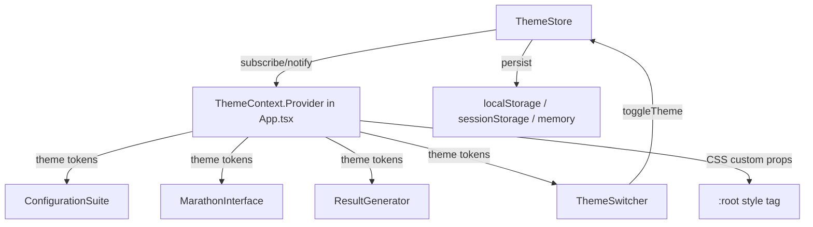

# Design Document: Theme Customization

## Overview

This feature adds a light/dark theme system to the challengeBiggerSweety math marathon app. The design is intentionally minimal: a `ThemeContext` provides theme tokens to all components, a `ThemeStore` extends the existing `MarathonStore` observer pattern for state management, and a `ThemeSwitcher` button floats consistently across all three screens.

Because the app uses inline React styles exclusively (no CSS files), theme application works by threading a `theme` object through React context — components read color tokens from context rather than hardcoding hex values. CSS transitions are injected via a single `<style>` tag in `index.html` to animate color changes without requiring a CSS build step.

Key design decisions:
- **Context over prop-drilling**: A `ThemeContext` makes theme tokens available anywhere without touching every component's props.
- **Separate ThemeStore**: Theme state lives in its own store class that mirrors `MarathonStore`'s subscribe/notify pattern, keeping marathon state and theme state independent (Requirement 8.5).
- **CSS custom properties for transitions**: Inline styles cannot be transitioned directly. We use CSS custom properties on `:root` updated via JavaScript, with a `transition` rule on `*` scoped to color/background-color. This is the only CSS added to the project.
- **Operation icons as pure components**: Math operation icons are simple SVG-based React components that accept a `color` prop, making them theme-aware without coupling to the theme system.

---

## Architecture



The `ThemeStore` is a singleton (like `marathonStore`) that manages a single `ThemeMode` value (`'light' | 'dark'`). `App.tsx` subscribes to it and passes the resolved `ThemeTokens` object down via `ThemeContext`. Components consume `useTheme()` to get tokens.

The `ThemeSwitcher` component is rendered once inside `App.tsx`, positioned fixed top-right, so it overlays all screens without each screen needing to know about it.

---

## Components and Interfaces

### ThemeStore (`src/store/ThemeStore.ts`)

```typescript
type ThemeMode = 'light' | 'dark';

class ThemeStore {
  private mode: ThemeMode;
  private listeners: Set<() => void>;

  constructor();
  getMode(): ThemeMode;
  toggle(): void;           // persists, notifies, updates CSS vars
  subscribe(fn: () => void): () => void;
  private notify(): void;
  private persist(mode: ThemeMode): void;
  private load(): ThemeMode; // localStorage → sessionStorage → 'light'
}

export const themeStore: ThemeStore;
```

`toggle()` is debounced — it sets a `isTransitioning` flag for 300ms to satisfy Requirement 7.4 (no double-toggle mid-animation). It also calls `updateCSSVars(mode)` which writes CSS custom properties to `document.documentElement.style`.

### ThemeContext (`src/theme/ThemeContext.ts`)

```typescript
export interface ThemeTokens {
  // Backgrounds
  bgPrimary: string;
  bgSecondary: string;
  bgCard: string;
  // Text
  textPrimary: string;
  textSecondary: string;
  textMuted: string;
  // Accents
  accentPrimary: string;   // orange-family — interactive elements
  accentSecondary: string; // complementary highlight
  accentSuccess: string;
  accentError: string;
  // Borders
  borderColor: string;
  // Switcher
  switcherBg: string;
  switcherIcon: string;
  // Mode identifier
  mode: 'light' | 'dark';
}

export const ThemeContext: React.Context<ThemeTokens>;
export const useTheme: () => ThemeTokens;
export const lightTokens: ThemeTokens;
export const darkTokens: ThemeTokens;
```

### ThemeSwitcher (`src/components/ThemeSwitcher.tsx`)

A fixed-position button (top: 16px, right: 16px) rendered in `App.tsx` above the screen router. Minimum 44×44px touch target. Displays a sun emoji (☀️) in dark mode and a moon emoji (🌙) in light mode to indicate what clicking will switch *to*.

```typescript
interface ThemeSwitcherProps {
  mode: ThemeMode;
  onToggle: () => void;
}
```

ARIA attributes: `aria-label="Switch to {opposite} mode"`, `aria-pressed={mode === 'dark'}`.

An ARIA live region (`aria-live="polite"`) in `App.tsx` announces `"Dark mode enabled"` / `"Light mode enabled"` on toggle (Requirement 10.5).

### OperationIcon (`src/components/OperationIcon.tsx`)

```typescript
type Operation = 'addition' | 'subtraction' | 'multiplication' | 'division';

interface OperationIconProps {
  operation: Operation;
  color?: string;  // defaults to accentPrimary from theme
  size?: number;   // defaults to 28, minimum 24
}
```

Renders a small SVG circle with the operation symbol centered inside. Used in `ConfigurationSuite` alongside each subject button. Color adapts to the active theme via `useTheme().accentPrimary` when no explicit `color` is passed.

---

## Data Models

### ThemeMode

```typescript
type ThemeMode = 'light' | 'dark';
```

Stored in localStorage under the key `'cbs-theme'` (cbs = challengeBiggerSweety).

### ThemeTokens — Light Palette

Designed to be bright, saturated, and cheerful for children while meeting WCAG AA contrast (4.5:1 for normal text).

| Token | Value | Notes |
|---|---|---|
| `bgPrimary` | `#FFF8F0` | Warm white — easy on eyes |
| `bgSecondary` | `#FFE8CC` | Soft peach |
| `bgCard` | `#FFFFFF` | Pure white cards |
| `textPrimary` | `#1A1A2E` | Near-black — 15.3:1 on bgPrimary |
| `textSecondary` | `#3D3D5C` | Dark purple-grey |
| `textMuted` | `#6B6B8A` | Muted purple |
| `accentPrimary` | `#FF6B00` | Vivid orange — 4.6:1 on white |
| `accentSecondary` | `#7C3AED` | Playful purple |
| `accentSuccess` | `#16A34A` | Green |
| `accentError` | `#DC2626` | Red |
| `borderColor` | `#FFD4A3` | Warm border |
| `switcherBg` | `#FFE8CC` | Matches bgSecondary |
| `switcherIcon` | `#FF6B00` | Orange icon |

### ThemeTokens — Dark Palette

Designed to reduce eye strain while keeping the playful character.

| Token | Value | Notes |
|---|---|---|
| `bgPrimary` | `#1A1A2E` | Deep navy |
| `bgSecondary` | `#16213E` | Slightly lighter navy |
| `bgCard` | `#0F3460` | Rich blue card |
| `textPrimary` | `#F0F0FF` | Near-white — 14.8:1 on bgPrimary |
| `textSecondary` | `#C8C8E8` | Light lavender |
| `textMuted` | `#8888AA` | Muted lavender |
| `accentPrimary` | `#FF8C00` | Warm orange — 4.7:1 on bgPrimary |
| `accentSecondary` | `#A78BFA` | Soft purple |
| `accentSuccess` | `#4ADE80` | Bright green |
| `accentError` | `#F87171` | Soft red |
| `borderColor` | `#2D2D5E` | Subtle border |
| `switcherBg` | `#16213E` | Matches bgSecondary |
| `switcherIcon` | `#FFD700` | Gold moon icon |

### CSS Custom Properties (transition layer)

`ThemeStore.toggle()` writes these to `document.documentElement.style`:

```
--cbs-bg-primary
--cbs-bg-secondary
--cbs-text-primary
--cbs-accent-primary
```

A `<style>` tag injected once at startup applies:

```css
*, *::before, *::after {
  transition: background-color 250ms ease, color 250ms ease, border-color 250ms ease;
}
```

This satisfies Requirement 7.1 (200–300ms) and Requirement 7.2 (CSS transitions). The transition is suppressed on initial load by adding a `no-transition` class to `<html>` that overrides the rule, removed after the first paint (Requirement 7.3).

### Storage Strategy

```
1. Try localStorage.setItem('cbs-theme', mode)
2. On SecurityError/QuotaExceededError → try sessionStorage
3. On failure → in-memory only (ThemeStore.mode field)
```

Load order mirrors the same priority (Requirement 6.3, 6.4).


---

## Correctness Properties

*A property is a characteristic or behavior that should hold true across all valid executions of a system — essentially, a formal statement about what the system should do. Properties serve as the bridge between human-readable specifications and machine-verifiable correctness guarantees.*

### Property 1: Theme mode is always binary

*For any* sequence of `toggle()` calls on `ThemeStore`, the value returned by `getMode()` is always either `'light'` or `'dark'` — never any other value.

**Validates: Requirements 1.1**

---

### Property 2: Storage round-trip

*For any* theme mode written to storage by `ThemeStore.toggle()`, constructing a new `ThemeStore` instance (which calls `load()` internally) should return the same mode from `getMode()`.

This covers both the persist-on-toggle (Requirement 6.1) and the load-on-init (Requirements 1.2, 6.2) sides of the round-trip.

**Validates: Requirements 1.2, 6.1, 6.2**

---

### Property 3: Toggle is an involution

*For any* starting mode, calling `toggle()` twice should return the store to the original mode. This is a round-trip / idempotence property: `toggle(toggle(mode)) === mode`.

**Validates: Requirements 2.3, 8.4**

---

### Property 4: Mode determines token set

*For any* theme mode, `useTheme()` (or the equivalent token resolver) should return `lightTokens` when mode is `'light'` and `darkTokens` when mode is `'dark'` — never a mix or an undefined value.

**Validates: Requirements 3.4, 4.4**

---

### Property 5: Token completeness

*For any* theme mode, the resolved `ThemeTokens` object must contain all required fields (`bgPrimary`, `bgSecondary`, `bgCard`, `textPrimary`, `textSecondary`, `textMuted`, `accentPrimary`, `accentSecondary`, `accentSuccess`, `accentError`, `borderColor`, `switcherBg`, `switcherIcon`, `mode`) with non-empty string values.

**Validates: Requirements 3.1, 4.1**

---

### Property 6: WCAG contrast thresholds

*For any* theme mode, the contrast ratio between `textPrimary` and `bgPrimary` must be ≥ 4.5:1 (WCAG AA normal text), and the contrast ratio between `accentPrimary` and `bgPrimary` must be ≥ 3:1 (WCAG AA large text / UI components).

Contrast ratio is computed using the standard WCAG relative luminance formula.

**Validates: Requirements 10.1, 10.2**

---

### Property 7: All subscribers notified on toggle

*For any* number of listeners subscribed to `ThemeStore`, calling `toggle()` once should invoke every subscribed listener exactly once.

**Validates: Requirements 8.2**

---

### Property 8: Theme state is independent of marathon state

*For any* sequence of `ThemeStore.toggle()` calls, the state returned by `marathonStore.getState()` must remain unchanged. Conversely, any `marathonStore` mutation (startMarathon, completeMarathon, etc.) must not affect `themeStore.getMode()`.

**Validates: Requirements 8.5**

---

### Property 9: Debounce prevents mid-transition re-toggle

*For any* two `toggle()` calls issued within the 300ms transition window, the second call should be a no-op — `getMode()` should reflect only the first toggle, and subscribers should be notified only once.

**Validates: Requirements 7.4**

---

### Property 10: OperationIcon color follows theme

*For any* theme mode, an `OperationIcon` rendered without an explicit `color` prop should use the `accentPrimary` value from the active theme's token set as its fill color.

**Validates: Requirements 5.6**

---

### Property 11: ThemeSwitcher ARIA reflects current mode

*For any* theme mode, the `ThemeSwitcher` component should render with `aria-pressed={mode === 'dark'}` and an `aria-label` that names the *opposite* mode (i.e., what clicking will switch to).

**Validates: Requirements 10.4**

---

### Property 12: Screen reader announcement on toggle

*For any* theme toggle, the ARIA live region in `App.tsx` should update its text content to announce the newly active mode (e.g., `"Dark mode enabled"` or `"Light mode enabled"`).

**Validates: Requirements 10.5**

---

## Error Handling

**Storage failures**: `ThemeStore.persist()` wraps `localStorage.setItem` in a try/catch. On `SecurityError` or `QuotaExceededError`, it falls back to `sessionStorage`. If that also throws, the mode is kept in memory only — the app continues to function normally, just without persistence across sessions.

**Invalid stored value**: If the value read from storage is neither `'light'` nor `'dark'` (e.g., corrupted data), `load()` discards it and returns `'light'` as the safe default.

**Context outside provider**: `useTheme()` throws a descriptive error if called outside `ThemeContext.Provider`, catching misconfigured component trees early in development.

**CSS injection failure**: The transition `<style>` tag injection is wrapped in a try/catch. If it fails (e.g., strict CSP), the app still works — transitions just won't animate.

---

## Testing Strategy

### Dual approach

Both unit tests and property-based tests are required. They are complementary:
- Unit tests cover specific examples, edge cases, and integration points.
- Property tests verify universal invariants across randomized inputs.

### Property-based testing library

Use **fast-check** (TypeScript-native, works with Vitest):

```
npm install --save-dev fast-check
```

Each property test runs a minimum of **100 iterations**. Tag format for traceability:

```
// Feature: theme-customization, Property N: <property text>
```

### Property tests (one per correctness property)

| Property | Test description | fast-check arbitraries |
|---|---|---|
| P1: Binary mode | `fc.nat()` toggle count → mode always in `{'light','dark'}` | `fc.nat({max: 50})` |
| P2: Storage round-trip | Random mode written, new store loaded → same mode | `fc.constantFrom('light','dark')` |
| P3: Toggle involution | Any mode → toggle twice → original mode | `fc.constantFrom('light','dark')` |
| P4: Mode → token set | Any mode → correct token object returned | `fc.constantFrom('light','dark')` |
| P5: Token completeness | Any mode → all fields present and non-empty | `fc.constantFrom('light','dark')` |
| P6: WCAG contrast | Any mode → contrast ratios meet thresholds | `fc.constantFrom('light','dark')` |
| P7: All subscribers notified | N subscribers → all called once on toggle | `fc.array(fc.func(fc.constant(undefined)), {minLength:1, maxLength:20})` |
| P8: State independence | Any marathon action → theme unchanged; any theme toggle → marathon state unchanged | `fc.constantFrom(...)` |
| P9: Debounce | Two rapid toggles → only one mode change | `fc.nat({max: 290})` (delay ms) |
| P10: Icon color follows theme | Any mode, any operation → icon fill = accentPrimary | `fc.constantFrom('light','dark')` × `fc.constantFrom('addition',...)` |
| P11: ARIA reflects mode | Any mode → correct aria-pressed and aria-label | `fc.constantFrom('light','dark')` |
| P12: Live region announcement | Any toggle → live region text updated | `fc.constantFrom('light','dark')` |

### Unit tests (examples and edge cases)

- Default to light mode when storage is empty (Req 1.3)
- Storage fallback: localStorage unavailable → sessionStorage used (Req 6.3)
- Storage fallback: both unavailable → in-memory only (Req 6.4)
- Invalid stored value (`'purple'`) → defaults to `'light'`
- CSS transition rule injected with 250ms duration (Req 7.1, 7.2)
- `no-transition` class present on init, removed after first paint (Req 7.3)
- ThemeSwitcher renders with min 44×44px touch target (Req 2.2)
- ThemeSwitcher is a `<button>` element (keyboard accessible, Req 10.3)
- ThemeSwitcher visible in ConfigurationSuite, MarathonInterface, ResultGenerator renders (Req 2.1)
- OperationIcon renders for all four operations without error (Req 5.1–5.4)
- OperationIcon has minimum size of 24px (Req 5.7)
- ThemeStore has `subscribe` and `notify` interface matching MarathonStore (Req 8.1)
